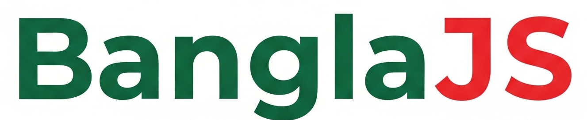

# 🌐 BanglaJS (বাংলা.জেএস)
<p align="center">
    
</p>
BanglaJS is a lightweight DOM manipulation library that allows developers to write JavaScript in Bengali. Perfect for beginners and educators who prefer coding in the native language.

BanglaJS হলো একটি হালকা DOM ম্যানিপুলেশন লাইব্রেরি যা দিয়ে আপনি বাংলা ভাষায় জাভাস্ক্রিপ্ট কোড লিখতে পারবেন। এটি নতুনদের ও শিক্ষার্থীদের জন্য দারুন উপযোগী।

---

## ✨ Features / বৈশিষ্ট্য

* ✅ Functions in Bengali keywords / বাংলা কিওয়ার্ডে ফাংশন
* ✅ DOM selection, text/HTML manipulation / DOM নির্বাচন, টেক্সট/HTML পরিবর্তন
* ✅ Event handling (click, keyboard, focus, etc.) / ইভেন্ট হ্যান্ডলিং (ক্লিক, কীবোর্ড, ফোকাস ইত্যাদি)
* ✅ CSS and style control / CSS এবং স্টাইল কন্ট্রোল
* ✅ AJAX/Fetch API (GET, POST, PUT, DELETE)
* ✅ Chainable API / চেইনেবল API

---

## 📦 Installation / ইনস্টলেশন

You can use BanglaJS in three ways:

- **CDN:**
    ```html
    <script src="https://cdn.jsdelivr.net/gh/arafat-web/banglajs/bangla.js"></script>
    ```

- **Download:**
    [bangla.js ডাউনলোড করুন](https://github.com/arafat-web/banglajs/archive/refs/heads/master.zip)

- **Local:**
    ```html
    <script src="bangla.js"></script>
    ```

CDN, ডাউনলোডকৃত বা লোকাল স্ক্রিপ্টটি আপনার `<head>` বা `<body>` ট্যাগে যুক্ত করুন।

---

## 🧪 Usage Example / ব্যবহার উদাহরণ

```html
<p id="text">হ্যালো!</p>
<button id="btn">লেখা বদলাও</button>

<script>
  // English: Change text and color on click
  // বাংলা: ক্লিক করলে লেখা ও রঙ পরিবর্তন
  $B('#btn').ক্লিক(function () {
    $B('#text')
      .লেখো('বাংলা rocks!')
      .রং('blue');
  });
</script>
```

---

## 📚 API Reference / API রেফারেন্স

| বাংলা মেথড                    | English Method/Description         | বাংলা ব্যাখ্যা                |
| ----------------------------- | ---------------------------------- | ----------------------------- |
| $B('selector')                | Select DOM elements                | DOM নির্বাচন                  |
| .লেখো('text')                 | Set textContent                    | টেক্সট পরিবর্তন              |
| .রং('color')                  | Set text color                     | টেক্সট রঙ পরিবর্তন           |
| .ব্যাকগ্রাউন্ডরং('color')     | Set background color               | ব্যাকগ্রাউন্ড রঙ পরিবর্তন     |
| .ক্লাস_দাও('class')           | Add class                          | ক্লাস যোগ                    |
| .ক্লাস_বাদ_দাও('class')       | Remove class                       | ক্লাস বাদ                    |
| .লুকাও()                      | Hide element                       | উপাদান লুকাও                 |
| .দেখাও()                      | Show element                       | উপাদান দেখাও                 |
| .css({prop: val})             | Set CSS styles                     | CSS স্টাইল সেট               |
| .html_দাও('html')             | Set innerHTML                      | HTML সেট করো                 |
| .html_নাও()                   | Get innerHTML                      | HTML নাও                     |
| .যুক্ত_করো('html')            | Append HTML                        | HTML যুক্ত করো               |
| .খালি_করো()                   | Empty element                      | উপাদান খালি করো              |
| .সরাও()                       | Remove element                     | উপাদান সরাও                  |
| .প্রথম()                      | Get first element                  | প্রথম উপাদান                 |
| .শেষ()                        | Get last element                   | শেষ উপাদান                   |
| .প্রতিটি(fn)                  | Loop through all elements          | প্রতিটি উপাদানে লুপ           |
| .সংখ্যা()                     | Total elements                     | মোট উপাদান সংখ্যা            |
| .মান_দাও('value')             | Set input value                    | ইনপুট মান দাও                |
| .মান_নাও()                    | Get input value                    | ইনপুট মান নাও                |
| .অ্যাট্রিবিউট_দাও(attr, val)  | Set attribute                      | অ্যাট্রিবিউট দাও              |
| .অ্যাট্রিবিউট_নাও(attr)       | Get attribute                      | অ্যাট্রিবিউট নাও              |
| .সক্রিয়_করো()                | Enable element                     | উপাদান সক্রিয় করো           |
| .নিষ্ক্রিয়_করো()              | Disable element                    | উপাদান নিষ্ক্রিয় করো         |
| .জমা(fn)                      | Form submit event                  | ফর্ম জমা ইভেন্ট              |

### 🎯 Event Methods / ইভেন্ট হ্যান্ডলার

| বাংলা মেথড                | English Description         | বাংলা ব্যাখ্যা           |
| ------------------------- | -------------------------- | ------------------------ |
| .ক্লিক(fn)                | Click event                | ক্লিক ইভেন্ট             |
| .ডাবল_ক্লিক(fn)           | Double click event         | ডাবল ক্লিক ইভেন্ট        |
| .মাউস_ওভার(fn)           | Mouse over event           | মাউস ওভার ইভেন্ট        |
| .মাউস_আউট(fn)            | Mouse out event            | মাউস আউট ইভেন্ট         |
| .কীবোর্ড(fn)             | Keyboard event             | কীবোর্ড ইভেন্ট          |
| .ফোকাস(fn)               | Focus event                | ফোকাস ইভেন্ট            |
| .ব্লার(fn)                | Blur event                 | ব্লার ইভেন্ট             |

---

## 🔗 API Manipulation / API ম্যানিপুলেশন

| বাংলা মেথড                    | English Description         | বাংলা ব্যাখ্যা           |
| ----------------------------- | -------------------------- | ------------------------ |
| .আনো_ডাটা(url, fn)           | GET request                | ডাটা আনো (GET)          |
| .পাঠাও_ডাটা(url, data, fn)   | POST request               | ডাটা পাঠাও (POST)       |
| .হালনাগাদ_করো(url, data, fn) | PUT request                | ডাটা আপডেট (PUT)        |
| .মুছে_ফেলো(url, fn)          | DELETE request             | ডাটা মুছে ফেলো (DELETE) |

---

## 📝 Examples for All Methods / সকল মেথডের উদাহরণ

```html
<!-- Text, Color, Background -->
$B('#demo').লেখো('নতুন লেখা').রং('red').ব্যাকগ্রাউন্ডরং('yellow');
// Set text, color, background

<!-- Class add/remove -->
$B('#demo').ক্লাস_দাও('active').ক্লাস_বাদ_দাও('active');
// Add/remove class

<!-- Show/Hide -->
$B('#demo').লুকাও();
$B('#demo').দেখাও();
// Hide/show element

<!-- CSS -->
$B('#demo').css({ fontSize: '20px', color: 'blue' });
// Set CSS styles

<!-- HTML -->
$B('#demo').html_দাও('<b>Bold</b>');
$B('#demo').html_নাও();
$B('#demo').যুক্ত_করো('<i>More</i>');
$B('#demo').খালি_করো();
$B('#demo').সরাও();
// Set/get/append/empty/remove HTML

<!-- Traversal -->
$B('li').প্রথম().লেখো('First');
$B('li').শেষ().লেখো('Last');
$B('li').প্রতিটি(function(el){ el.style.color='green'; });
$B('li').সংখ্যা();
// DOM traversal and loop

<!-- Value & Attribute -->
$B('#input').মান_দাও('Hello');
$B('#input').মান_নাও();
$B('#input').অ্যাট্রিবিউট_দাও('placeholder', 'নতুন');
$B('#input').অ্যাট্রিবিউট_নাও('placeholder');
// Set/get value and attribute

<!-- Enable/Disable -->
$B('#input').নিষ্ক্রিয়_করো();
$B('#input').সক্রিয়_করো();
// Disable/enable input

<!-- Form Submit -->
$B('#form').জমা(function() {
  const val = $B('#input').মান_নাও();
  alert('Input: ' + val);
});
// Form submit event

<!-- Events -->
$B('#btn').ক্লিক(function() { ... });
$B('#btn').ডাবল_ক্লিক(function() { ... });
$B('#btn').মাউস_ওভার(function() { ... });
$B('#btn').মাউস_আউট(function() { ... });
$B('#input').কীবোর্ড(function() { ... });
$B('#input').ফোকাস(function() { ... });
$B('#input').ব্লার(function() { ... });
// All event handlers

<!-- AJAX -->
$B().আনো_ডাটা('url', function(err, data) { ... });
$B().পাঠাও_ডাটা('url', {key:'val'}, function(err, data) { ... });
$B().হালনাগাদ_করো('url', {key:'val'}, function(err, data) { ... });
$B().মুছে_ফেলো('url', function(err, data) { ... });
// AJAX: GET, POST, PUT, DELETE
```

---

## 📃 License / লাইসেন্স

MIT License — Open-source & free for use.
